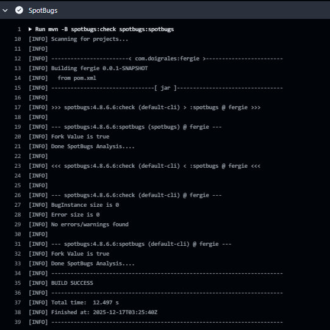
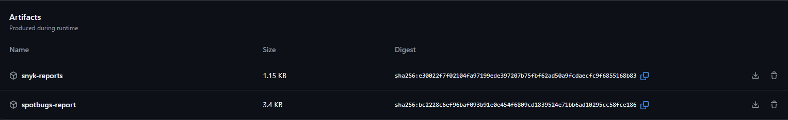
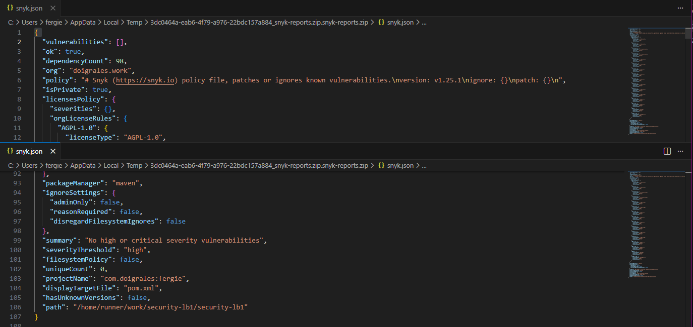

# Работа 1: Разработка защищенного REST API с интеграцией в CI/CD
## 1. Ссылка на репозиторий
Публичный репозиторий с кодом проекта:  
https://github.com/FergieDoigrales/security-lb1

---

## 2. Описание проекта
REST API на Java Spring Boot - приложение реализует аутентификацию пользователей, защищённые эндпоинты и хранение данных
в базе данных PostgreSQL.
* SAST - SpotBugs
* SCA - Snyk

### Стек:
* Spring Boot
* Hibernate ORM / PostgreSql
* JWT
* GitHub Actions, SpotBugs и Snyk

---

## 3. Описание API

### POST /auth/login
Метод для аутентификации пользователя, при успешной аутентификации возвращается токен JWT.

**Пример запроса:**
```json
{
  "username": "user",
  "password": "password"
}
```
**Пример ответа:**
```json
{
  "token": "eyJhbGciOiJIUzI1NiJ9.eyJzdWI...18"
}
```

### POST /auth/register
Метод для регистрации пользователя, возвращает токен JWT.

**Пример запроса:**
```json
{
  "username": "user",
  "password": "password"
}
```
**Пример ответа:**
```json
{
  "token": "eyJhbGciOiJIUzI1NiJ9.eyJzdWI...18"
}
```

### GET /api/posts
Защищённый эндпоинт для получения списка постов, доступен только для аутентифицированных пользователей.

**Заголовок запроса:**
```
Authorization: Bearer <JWT_TOKEN>
```
**Пример ответа:**
```json
{
  "id": 1,
  "title": "rndm post",
  "content": "fergie",
  "createdAt": "2025-12-17T03:38:40.529825600Z",
  "author": "user"
}
```

### POST /api/posts
Защищённый эндпоинт для создания нового поста.

**Заголовок запроса:**
```
Authorization: Bearer <JWT_TOKEN>
```

**Пример запроса:**
```json
{
"title": "rndm post",
"content": "fergie"
}
```
**Пример ответа:**
```json
{
  "id": 1,
  "title": "rndm post",
  "content": "fergie",
  "createdAt": "2025-12-17T03:38:40.529825600Z",
  "author": "user"
}
```

## Реализованные меры безопасности
### Защита от SQL-инъекций
Для работы с базой данных используется Spring Data JPA и Hibernate, следовательно, все SQL-запросы формируются ORM, параметризация выполняется автоматически,
конкатенация SQL-строк вручную не используется.

Пример:
```Java
public interface UserRepository extends JpaRepository<User, Long> {
    Optional<User> findByUsername(String username);
}
```

### Защита от XSS
Все пользовательские данные, возвращаемые клиенту, экранируются, для этого используется библиотека Apache Commons Text (StringEscapeUtils.escapeHtml4),
что предотвращает выполнение JavaScript-кода.

Пример DTO:
```Java
public static PostResponse from(Post p) {
        return new PostResponse(
                p.getId(),
                StringEscapeUtils.escapeHtml4(p.getTitle()),
                StringEscapeUtils.escapeHtml4(p.getContent()),
                p.getCreatedAt(),
                StringEscapeUtils.escapeHtml4(p.getAuthor().getUsername())
        );
    }
```
Проверим экранирование:


### Защита от Broken Authentication
Реализована аутентификация на основе JWT:
* После успешного входа пользователю выдаётся JWT-токен
* Доступ без токена запрещён
* Для всех защищённых эндпоинтов проверяется валидность токена

Реализован JwtAuthFilter, наследуемый от OncePerRequestFilter:
```Java
@Override
protected void doFilterInternal(HttpServletRequest request, HttpServletResponse response, FilterChain chain)
        throws ServletException, IOException {

    String auth = request.getHeader("Authorization");

    if (auth != null && auth.startsWith("Bearer ")) {
        String token = auth.substring(7);
        try {
            String username = jwtService.validateAndGetSubject(token);
            var userDetails = userDetailsService.loadUserByUsername(username);
            var authentication = new UsernamePasswordAuthenticationToken(
                    userDetails, null, userDetails.getAuthorities()
            );
            SecurityContextHolder.getContext().setAuthentication(authentication);
        } catch (JwtException | IllegalArgumentException ex) {
            SecurityContextHolder.clearContext();
            response.setStatus(HttpServletResponse.SC_UNAUTHORIZED);
        }
    }
```
* Пароли пользователей хранятся в БД в виде хэшей bcrypt
```Java
    user.setPasswordHash(passwordEncoder.encode(req.getPassword()));
    userRepository.save(user);
```
Все методы, кроме /auth/register и /auth/login требуют аутентификации:
```Java
    .authorizeHttpRequests(auth -> auth
    .requestMatchers("/auth/login").permitAll()
    .requestMatchers("/auth/register").permitAll()
    .anyRequest().authenticated()
```

---

## CI/CD: SAST/SCA
В проекте настроен CI/CD пайплайн GitHub Actions, который автоматически выполняет сборку, тестирование и проверку безопасности кода и зависимостей при каждом push/pull request.

* Последний успешный запуск: https://github.com/FergieDoigrales/security-lb1/actions/runs/20290542657

Проверка SpotBugs:


Проверка Snyk:


Артефакты отчетов:


Сгенерированный отчет SpotBugs:


Сгенерированный отчет Snyk:

